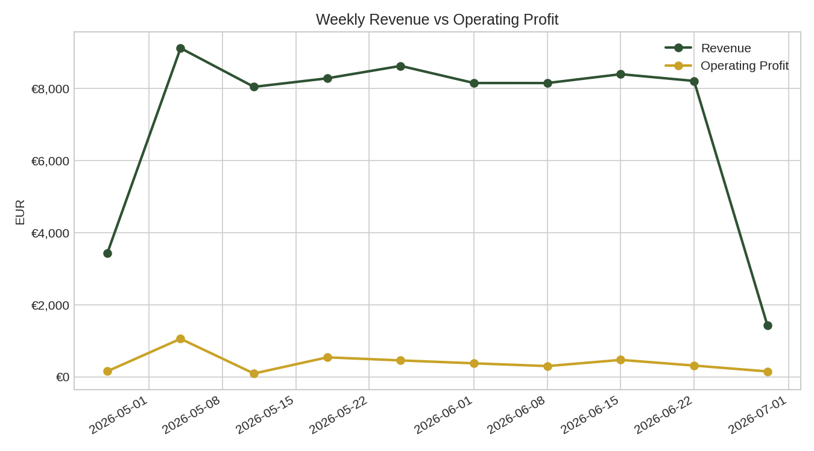

# Dean & David  Restaurant Profit & Loss Analysis

A Python data analytics project that builds a full Profit & Loss (P&L)
pipeline for a quick-service restaurant, inspired by my time working
at a **Dean & David** outlet in Berlin. Real financial data from the
business isn't shareable, so this project uses a **synthetic but
realistic 60-day sample dataset** (menu, item-level sales, labor
hours, overheads) that mirrors the structure of an actual POS/labor
export — meaning the exact same pipeline can be pointed at real data
with zero changes to the code.

> **Disclaimer:** All data in `/data` is synthetically generated
> (see `src/generate_sample_data.py`) for demonstration purposes. It
> does not represent actual Dean & David financials.

## Why this project

As a Big Data & AI master's student working front-of-house at a
restaurant, I wanted a hands-on project that goes beyond a generic
Kaggle dataset  one that mirrors a real operational analytics
problem: turning raw sales and labor data into a management-ready
P&L with actionable recommendations.

## Project structure

```
dean-david-pl-analysis/
├── data/                      # Raw sample data (CSV, POS/labor-export style)
│   ├── menu.csv
│   ├── daily_sales.csv
│   ├── labor.csv
│   └── overheads.csv
├── src/
│   ├── generate_sample_data.py   # Recreates the synthetic dataset
│   ├── pl_calculations.py        # Core P&L logic (revenue, COGS, margins, rollups)
│   └── run_analysis.py           # Main script: computes P&L, saves charts + report
├── dashboard/
│   └── app.py                    # Interactive Streamlit dashboard
├── outputs/
│   ├── charts/                   # Generated PNG charts
│   ├── daily_pl_summary.csv
│   ├── weekly_pl_summary.csv
│   ├── item_profitability.csv
│   └── insights_report.txt
├── requirements.txt
└── README.md
```

## What the analysis covers

- **Revenue, COGS, Gross Profit & Gross Margin** — daily and weekly
- **Labor cost** as a % of revenue (with a healthy-range benchmark line)
- **Operating Profit & Operating Margin** after allocating fixed overheads
- **Item-level profitability** — which menu items drive the most profit vs. which have thin margins
- **Demand patterns by day of week** — to sanity-check staffing against actual footfall

## Sample results (from the synthetic dataset)

- Total revenue (60-day period): **€71,861**
- Average gross margin: **68.3%**
- Average operating margin: **2.7%**
- Average labor cost as % of revenue: **46.7%** — above the ~30% industry guideline, flagged as an area to investigate
- Highest-revenue day: **Friday** · Lowest: **Saturday**
- Top profit contributor: **Chicken Teriyaki Bowl**

Full breakdown in [`outputs/insights_report.txt`](outputs/insights_report.txt).

### Example chart



More charts (item margin ranking, profit contribution by item, labor
cost trend, weekday demand pattern) are in `outputs/charts/`.


Outputs (summary CSVs, charts, insights report) are written to `/outputs`.

## Interactive dashboard

An interactive Streamlit dashboard lets you filter by date range and
menu category and explore all metrics live (KPIs, revenue vs. profit
trend, labor cost %, item margins, weekday demand pattern).

```bash
streamlit run dashboard/app.py
```

This opens in your browser at `http://localhost:8501`.

**Deploy it for free (shareable link):**
1. Push this repo to GitHub (see steps below)
2. Go to [share.streamlit.io](https://share.streamlit.io), sign in with GitHub
3. Click "New app", select this repo, set the main file path to `dashboard/app.py`
4. Deploy — you get a public URL to put on your CV/LinkedIn/GitHub profile

## Using this with real data

Point `pl_calculations.load_data()` at real exports that follow the
same column structure as the sample CSVs:

| File | Required columns |
|---|---|
| `menu.csv` | `item, category, price_eur, unit_cost_eur` |
| `daily_sales.csv` | `date, item, category, quantity_sold, unit_price_eur, unit_cost_eur` |
| `labor.csv` | `date, total_staff_hours, blended_wage_rate_eur` |
| `overheads.csv` | `overhead_item, monthly_cost_eur` |

No other code changes are needed — `run_analysis.py` will recompute
everything against the new data.

## Possible next steps

- Break-even analysis (units/day needed to cover fixed + labor costs)
- Waste/spoilage tracking and its margin impact
- Interactive dashboard (Power BI / Streamlit) on top of the summary tables
- Forecasting demand by day of week / season

## Tech stack

Python · pandas · matplotlib

## Author

**Shushrutha Reddy** — MSc student, Data Analytics,
Berlin School of Bussinees and Innovation.
